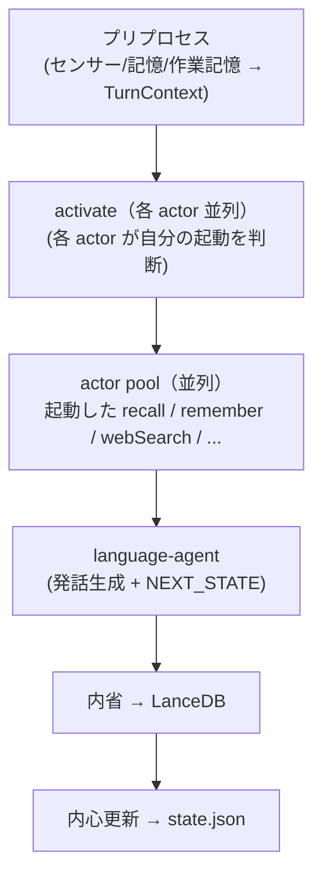

# 行動設計（v0.7）

ステータス: **実装済み（actor pool）**

## カテゴリ（意図軸）

| kind | 日本語 | 意味 |
|------|--------|------|
| `memory` | 記憶 | 自分の永続状態だけを変える（LanceDB・notes） |
| `research` | 探索 | 外から情報を取り込む（MCP: web・URL・センサー） |
| `express` | 発信 | 外の世界を変える/他者に見える（MCP: SNS・予定登録） |

思索はアクションではない。記憶操作（`recall` / `distill`）として memory に吸収する。

## パイプライン（v0.7 actor pool）

```
[入力フェーズ] プリプロセス
  センサー・永続記憶・作業記憶から TurnContext を組み上げる
       ↓
[自律エージェントフェーズ]
  activate（各 actor 並列）: 各 actor が mini-context を読み自分の起動可否を判断
       ↓
  actor pool（並列）: 起動した各 actor が自律実行 → ctx.actions に積む
       ↓
  language-agent: 全 facts を受け取り発話生成 + NEXT_STATE 決定
       ↓
  内省: speech + ctx.actions を読み内省文を生成 → LanceDB へ書き込み
       ↓
  内心更新 → state.json
```



## actor 一覧

| actor | kind | 説明 |
|-------|------|------|
| `recall` | memory | LanceDB ベクトル検索で意識的に想起 |
| `remember` | memory | LanceDB にファクト追記 |
| `forget` | memory | LanceDB からソフト削除（`deleted` フラグ） |
| `memoWrite` | memory | `data/notes/` に書く |
| `memoRead` | memory | `data/notes/` を読む（memo_index で pick） |
| `webSearch` | research | MCP 経由 Web 検索（指示ベース・内心ベース両対応） |
| `urlBrowse` | research | MCP 経由 URL 閲覧 |
| `webcam` | research | カメラ映像取得（未実装） |
| `plan` | memory | ゴールノート（`goals/*.md`）の作成/更新。集中モードの計画進行管理（追記保全・状態と履歴のみ） |

### 記憶 vs メモの鮮明さ

| | エピソード記憶（LanceDB） | 共有メモ（ファイル） |
|--|---------------------------|----------------------|
| 性格 | 会話のふんわりした想起 | 意図して残した全文 |
| LLM | 想起・`recall` で要約・圧縮してよい | **既存本文の要約・改変はしない** |
| 重さ | 距離・提示濃さでぼかす | ファイルはそのまま全部渡す |

## 探索・発信（MCP）

- web 検索は **Tavily API**（`scripts/mcp-research.mjs`、Docker 不要。`.env` の `TAVILY_API_KEY` を使用）。`browse_url` は素の fetch。旧 searxng は legacy
- 設定: [config/mcp.json](../config/mcp.json)
- クライアント: `src/mcp/client.ts`（`@modelcontextprotocol/sdk`）
- MCP サーバ未接続時: `FakeMcpToolProvider` のスタブ（`web_search`, `browse_url` 等）
- 発信: `expressDryRun`（既定 `true`）。`EXPRESS_DRY_RUN=false` で実投稿

発信 actor は共有言語機能（`src/roles/language-faculty.ts`）で文面を生成し、ユーザー向け言語野と persona を共有する。

## ActionFacts

```typescript
type ActionFacts =
  | { kind: "memo_read";  filename: string; body: string }
  | { kind: "memo_write"; filename: string; body: string }
  | { kind: "remember";   body: string }
  | { kind: "recall";     bullets: string[] }
  | { kind: "forget";     body: string }
  | { kind: "research";   tool: string; title: string; body: string }
  | { kind: "express";    tool: string; title: string; body: string };
```

`recall` 行動成功時は `recallDelivery: omit`（背景想起と重複するため）。

## 複雑化の吸収（反ネスト原則）

優先順: 複合ツール → サブエージェント内多段ループ（最大5ステップ）→ カテゴリ分割 → （最終手段）ネスト

## 歴史的経緯

v0.6 以前は memory-agent / research-agent の束ねエージェントが直列に動いていた。
v0.7 でフラットな actor pool に統一（DECISIONS.md §エージェント設計 v0.7 参照）。
廃止設計の詳細記録は `docs/archive/deliberation-plan-deprecated.md`。
