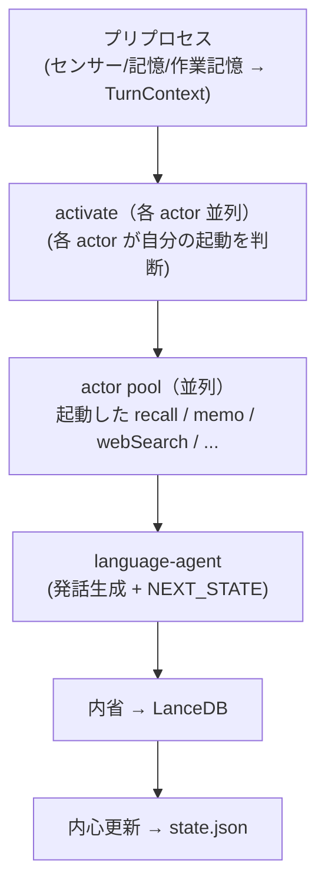

# 行動設計（v0.7）

ステータス: **実装済み（actor pool）**

## カテゴリ（意図軸）

| kind | 日本語 | 意味 |
|------|--------|------|
| `memory` | 記憶 | 自分の永続状態だけを変える（LanceDB・notes） |
| `research` | 探索 | 外から情報を取り込む（MCP: web・URL・センサー） |
| `express` | 発信 | 外の世界を変える/他者に見える（MCP: SNS・予定登録）。**型としては存在するが、現状ライブな express actor は未配線**（research のみ稼働） |

思索はアクションではない。記憶操作（`recall`）として memory に吸収する。

## パイプライン（v0.7 actor pool）

```
[入力フェーズ] プリプロセス
  センサー・永続記憶・作業記憶から TurnContext を組み上げる
       ↓
[自律エージェントフェーズ]
  activate（各 actor 並列）: 各 actor が mini-context を読み自分の起動可否を判断
       ↓
  actor pool（並列）: 起動した各 actor が自律実行 → ctx.actions に積む
       ↓
  language-agent: 全 facts を受け取り発話生成 + NEXT_STATE 決定
       ↓
  内省: speech + ctx.actions を読み内省文を生成 → LanceDB へ書き込み
       ↓
  内心更新 → state.json
```



## actor 一覧

| actor | kind | 説明 |
|-------|------|------|
| `recall` | memory | LanceDB ベクトル検索で意識的に想起 |
| ~~`remember`~~ | — | **廃止・完全削除**（actor＋`runRemember`/`REMEMBER_SYSTEM`/schema を除去）。意図的な内部記憶は「書き込み」でなく、内省の importance 採点（気にかけた発話ほど高く＝残りやすく）で扱う。`EpisodeSource "remember"` と present 表示は履歴エピソード用に温存 |
| `forget` | memory | LanceDB からソフト削除（`deleted` フラグ） |
| `memo` | memory | `data/notes/` を読み書きする統合 actor。フェーズ1=対象を pick して全文ロード（read-before-edit）→フェーズ2=op を1つ（view/create/append/replace/section_replace/noop）を純関数 applier で適用。詳細 [MEMO-TREE.md](MEMO-TREE.md) |
| `webSearch` | research | MCP 経由 Web 検索（指示ベース・内心ベース両対応） |
| `urlBrowse` | research | MCP 経由 URL 閲覧 |
| `webcam` | research | カメラ映像取得（未実装） |
| `plan` | memory | ゴールノート（`goals/*.md`）の作成/更新。集中モードの計画進行管理（追記保全・状態と履歴のみ） |
| `synthesize` | memory | 想起＋外部情報＋感性（内心/関心事）を統合して成果物（歌詞・読書メモ・まとめ・文章）を**生成**し `works/<id|slug>.md` へ外化する。memo（強制ギプス・転記）と違い**生成が役割**の唯一のレーン。append で継ぎ足し（既存破壊なし）。「行動としての思考」 |

### memo と synthesize の違い（転記 vs 生成）

両者とも `data/notes/` に書くが、レーンが違う:

| | `memo` | `synthesize` |
|--|--------|--------------|
| 役割 | 決まったことを**正確に転記**する（台帳・リスト・決定） | 素材を統合して**新しく作る/まとめる** |
| LLM の生成 | 禁止（強制ギプス・op を1つ出すだけ） | **生成こそが役割**（歌詞・読書メモ・要約・文書） |
| 入力 | 対象メモの全文（read-before-edit） | 想起・外部情報・内心/関心事・計画を統合 |
| 出力先 | 主題のメモ（recall認識 or descent で特定） | `works/<planId or slug>.md`（成果物として決定的） |

判断は両方 LLM の activate に委ねる（キーワード分岐しない）。「メモして」「あれ見て」は memo、「書いて」「作って」「まとめて」や集中作業の成果物前進は synthesize。

### 記憶 vs メモの鮮明さ

| | エピソード記憶（LanceDB） | 共有メモ（ファイル） |
|--|---------------------------|----------------------|
| 性格 | 会話のふんわりした想起 | 意図して残した全文 |
| LLM | 想起・`recall` で要約・圧縮してよい | **要約しない**。構造保存的な op 編集（厳密置換・見出し差し替え）は read-before-edit を条件に可 |
| 重さ | 距離・提示濃さでぼかす | ファイルはそのまま全部渡す |

## 探索・発信（MCP）

- web 検索は **Tavily API**（`scripts/mcp-research.mjs`、Docker 不要。`.env` の `TAVILY_API_KEY` を使用）。`browse_url` は素の fetch。旧 searxng は legacy
- 設定: [config/mcp.json](../config/mcp.json)
- クライアント: `src/mcp/client.ts`（`@modelcontextprotocol/sdk`）
- MCP サーバ未接続時: `FakeMcpToolProvider` のスタブ（`web_search`, `browse_url` 等）
- 発信: `expressDryRun`（既定 `true`）。`EXPRESS_DRY_RUN=false` で実投稿

発信 actor は共有言語機能（`src/roles/language-faculty.ts`）で文面を生成し、ユーザー向け言語野と persona を共有する。

## ActionFacts

```typescript
type ActionFacts =
  | { kind: "memo_read";  filename: string; body: string }
  | { kind: "memo_write"; filename: string; body: string }
  | { kind: "remember";   body: string }
  | { kind: "recall";     bullets: string[] }
  | { kind: "forget";     body: string }
  | { kind: "research";   tool: string; title: string; body: string }
  | { kind: "express";    tool: string; title: string; body: string }
  | { kind: "synthesize"; filename: string; body: string }
  | { kind: "plan";       planId: string; filename: string; body: string; achieved: boolean };
```

`recall` 行動成功時は `recallDelivery: omit`（背景想起と重複するため）。

## 長い行動結果の扱い（3宛先で非対称）

調査・創作の結果は通常の発話より長い。これを **speech（言語化の結果）に再生成させない**。speech は短い橋渡しの一言で、成果物本体は別経路でユーザーに届ける。長さの扱いを宛先ごとに非対称にする（`src/action/present.ts`）:

| 宛先 | 渡し方 | 理由 |
|------|--------|------|
| **ユーザー出力（チャット）** | **全文**（`TurnResult.artifacts`） | 作った/調べた本体はこれ。speech とは別経路で全文提示 |
| **言語野の入力** | 冒頭120字＋「全文は別途届く・書き写すな」注記 | 全文を渡すと言語野が書き直し**二重生成＆劣化**する |
| **内省の入力** | 冒頭120字＋分量メタ（全◯字・◯行） | エピソードは要約層。全文は works/・memo_index が正本。手応えだけ残す |

- ユーザー出力の線引きは **「そのターンのプリプロセスまでの情報を読んでも出てこない情報は全文出す」**＝新規情報 kind のみ（`factExternalizesNewInfo`）: `synthesize`（生成）/ `research`（外部取得）/ `memo_read`（全文を初ロード＝読み上げ意図）。`memo_write`（既出の転記）・`recall`・`plan` は出さない。
- 音声など本文を読み上げない宛先では、出力側が `artifacts` を出さない選択をする（チャンネル能力での出し分け）。CLI/Slack は常に提示。
- `synthesize` の `body` は**そのターンで作った一片**（成果物の全文ではない）。

## 複雑化の吸収（反ネスト原則）

優先順: 複合ツール → actor 内の多段ループ（`recall` の最大3ステップ等）→ actor を増やす → （最終手段）ネスト

## 歴史的経緯

v0.6 以前は memory-agent / research-agent の束ねエージェントが直列に動いていた。
v0.7 でフラットな actor pool に統一（DECISIONS.md §エージェント設計 v0.7 参照）。
2026-06 に残っていた dead-in-prod の旧経路（`action.ts`/`runCategorySubagent`/`runMemorySubagent`/`runExpressSubagent`、旧 `memo-write.ts`/`memo-read.ts` role）を削除。
廃止設計の詳細記録は `docs/archive/deliberation-plan-deprecated.md`。
