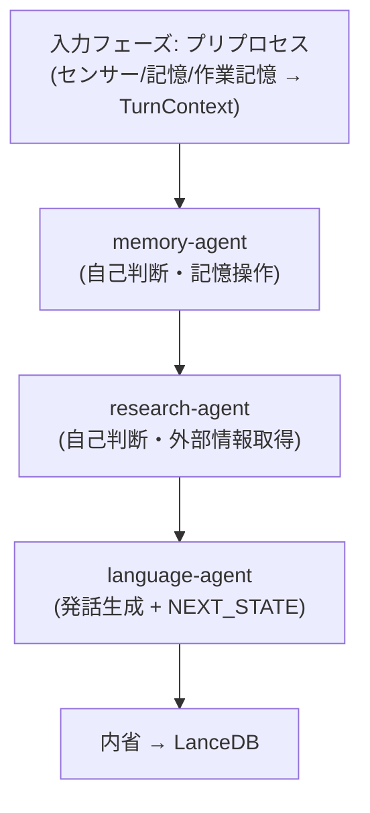

# 抽象 ACTION 設計（v0.5）

ステータス: **v0.6 設計確定（実装前）**  
方針: ジャッジ廃止。各エージェント（memory / research / language）が TurnContext を読んで自己判断・直列実行する。

## カテゴリ（意図軸）

| kind | 日本語 | 意味 |
|------|--------|------|
| `none` | 何もしない | 行動不要 |
| `memory` | 記憶 | 自分の永続状態だけを変える（LanceDB・notes） |
| `research` | 探索 | 外から情報を取り込む（MCP: web・予定照会・センサー） |
| `express` | 発信 | 外の世界を変える/他者に見える（MCP: SNS・予定登録） |

思索はアクションではない。記憶操作（`recall` / `distill`）として `memory` に吸収する。

## レイヤモデル（用語の整理）

「層」を 2 つの意味で使い分ける。混同しないこと。

### A. 認知の構造（ターン全体のパイプライン）

エージェント1ターンの流れは **入力フェーズ** と **自律エージェントフェーズ** の 2 フェーズ。

```
[入力フェーズ] プリプロセス
  センサー・永続記憶・作業記憶から揮発コンテキスト（TurnContext）を組み上げる
  フィルタは TurnContext に載せる量を絞るだけ（元データ変更なし）
       ↓
[自律エージェントフェーズ] 直列実行（本来は並行を直列で近似）
  memory-agent: 記憶操作を自己判断・実行 → ctx.actions に追加
       ↓
  research-agent: 外部情報取得を自己判断・実行 → ctx.actions に追加
       ↓
  language-agent: 全 facts を受け取り発話生成 + NEXT_STATE 決定
       ↓
  内省: speech + ctx.actions だけを読み内省文を生成 → LanceDB へ書き込み
```

プリプロセスがこのアーキテクチャの起点。全エージェントが同一の `TurnContext` を参照する（事実の一元化）。前エージェントの facts は後エージェントから参照可能（直列近似の帰結）。



## 記憶サブエージェントのツール

| tool | 説明 |
|------|------|
| `remember` | LanceDB にファクト追記 |
| `recall` | LanceDB から意識的に掘り出す |
| `forget` | LanceDB からソフト削除 |
| `memo_write` | `data/notes/` に書く |
| `memo_read` | `data/notes/` を読む（冒頭抜粋インデックスで pick） |
| `distill` | 意味記憶蒸留（スタブ・未実装） |

### 記憶 vs メモの鮮明さ

| | エピソード記憶（LanceDB） | 共有メモ（ファイル） |
|--|---------------------------|----------------------|
| 性格 | 会話のふんわりした想起 | 意図して残した全文 |
| LLM | 想起・`recall` で要約・圧縮してよい | **既存本文の要約・改変はしない** |
| 重さ | 距離・提示濃さでぼかす | ファイルはそのまま全部渡す |

## 探索・発信（MCP）

- 設定: [config/mcp.json](../config/mcp.json)
- クライアント: `src/mcp/client.ts`（`@modelcontextprotocol/sdk`）
- MCP サーバ未接続時: `FakeMcpToolProvider` のスタブツール（`web_search`, `browse_url`, `calendar_read`, `post_tweet`, `calendar_write`）
- 発信: `expressDryRun`（既定 `true`）。`EXPRESS_DRY_RUN=false` で実投稿

### 発信と言語機能

発信サブエージェントは共有 **言語機能**（`src/roles/language-faculty.ts`）で文面を生成し、同一ターンで投稿する。ユーザー向け言語野と persona を共有し、声の分裂を防ぐ。

## ActionFacts

記憶系は従来どおり typed facts。探索・発信は汎用 facts:

```typescript
{ kind: "research" | "express"; tool: string; title: string; body: string }
```

## ターンの流れ

```
[入力] プリプロセス → [自律] memory-agent → research-agent → language-agent → 内省 → LanceDB
```

`recall` 行動成功時は `recallDelivery: omit`（`facts.kind === "recall"` で判定）。

## 複雑化の吸収（反ネスト原則）

優先順: 複合ツール → サブエージェント内多段ループ（最大5ステップ）→ カテゴリ分割 → （最終手段）ネスト
